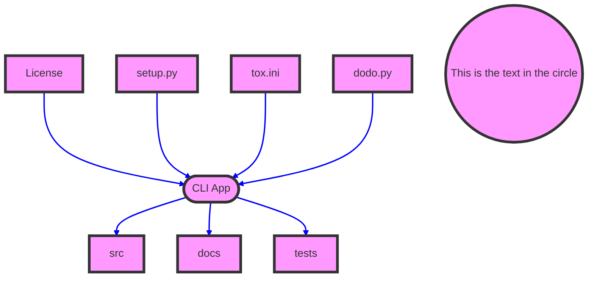
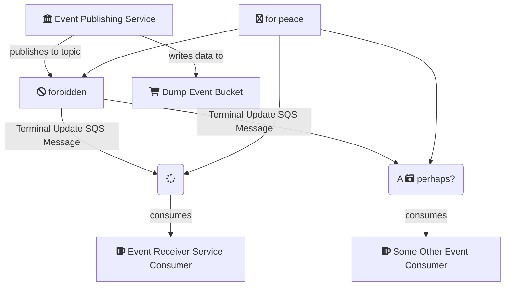

# Swiss Army Knife

> Python CLI tool


* Easiest CLI api using [click], as compared to nodejs, dotnetcore, plain shell script etc.
  * cross platform, decorator styled cli arguments
  * Supports lazy loading of subcommands at runtime
  * Arbitrary nesting of commands
  * Automatic help page generation

```
python3 -m venv venv
source venv/bin/activate.fish
pip install --upgrade pip

python setup.py develop
sak --count=5
```

### Problems

1. How to package, publish and distribute app?
2. Which build tool to use?






[click]: https://github.com/pallets/click


### Resources

* [python-testing-frameworks](https://www.softwaretestinghelp.com/python-testing-frameworks/)
* [python build tools](https://wiki.python.org/moin/ConfigurationAndBuildTools)


#### Get in touch with me

> I am looking for Jobs ... :sunglasses:

* [Github](https://github.com/avimehenwal/)
* [My Website](https://avimehenwal.in)
* [Twitter Handle](https://twitter.com/avimehenwal)
* [LinkedIn](https://in.linkedin.com/in/avimehenwal)
* [Stackoverflow](https://stackoverflow.com/users/1915935/avi-mehenwal)

<a href="https://www.buymeacoffee.com/F1j07cV" target="_blank"></a>

 Spread Love :hearts: and not :no_entry_sign: hatred   [](https://twitter.com/avimehenwal)